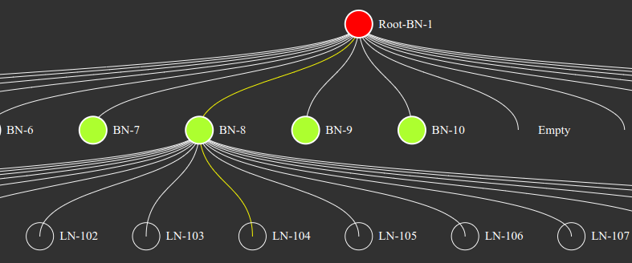

## Ethereum Transaction Merkle Tree Visualizer



This is a project to visualize the Ethereum Transaction Merkle Tree data structure using [Next.js](https://nextjs.org/) and react-d3-tree. The project fetches the block data using web3.js APIs and creates the ethereum transaction trie using the transactions data in the block. Then it walks through the trie data structure to create a json database of nodes. Finally it renders the trie nodes and node details using React components.

## Getting Started

If you want to fetch the block data using web3.js APIs, add the .env file in root folder of your project and provide the URL for node API you want to use. For example if you are using Alchemy, add variable as follows:

```
NEXT_PUBLIC_WEB3_API_URL="https://eth-mainnet.g.alchemy.com/v2/YOUR_API_KEY"
```

Note: This is a react app and hence the env variables added can be seen by anyone using dev tools. If you want to protect the API keys for production use you can run the node app on server.

Next, install the packages and run the application as follows and check the page http://localhost:3000 in your browser

```bash
npm i
npm run dev
# or
yarn dev
```

## Unit testing

You can unit test the application without fetching the block using web3 API and directly providing the block data in json format. To do so update the following lines from pages/index.js

```
import testblock from "../testblock3.json"
const TEST_MODE = 1
```

## Demo

https://milindmovasha.github.io/show-merkle-tree/
